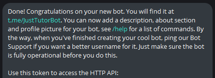
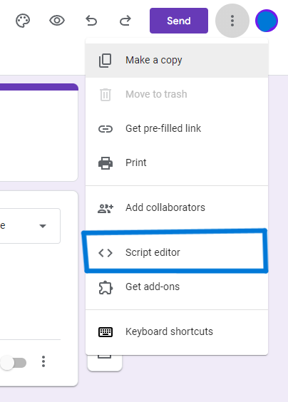
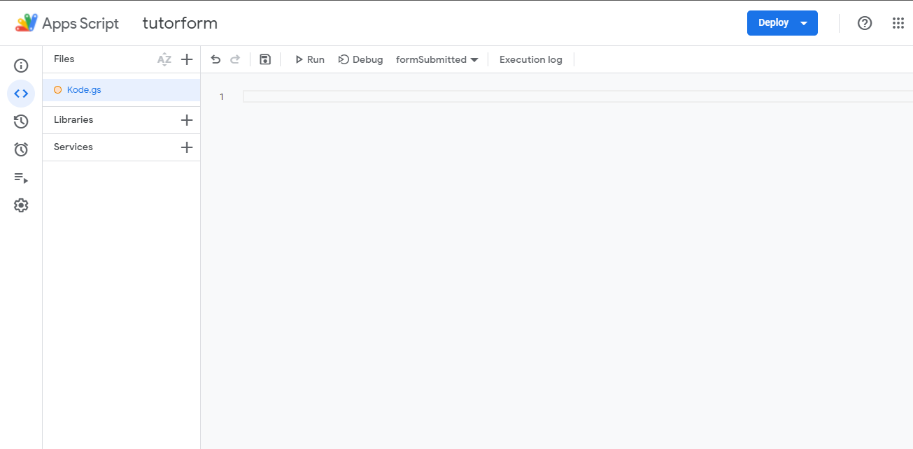
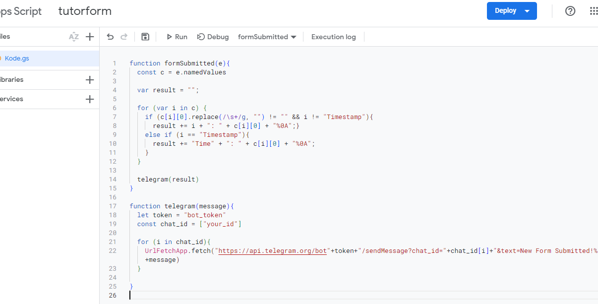
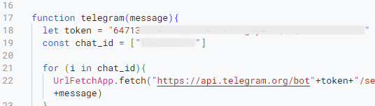
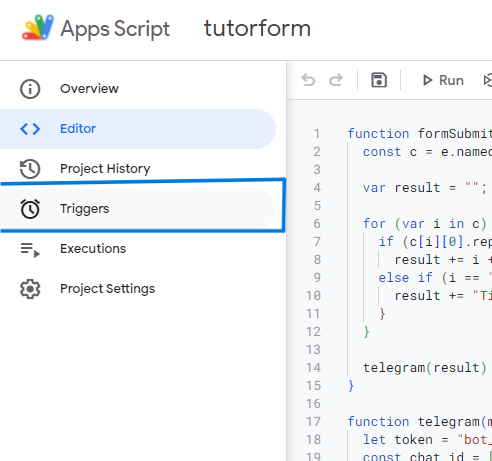
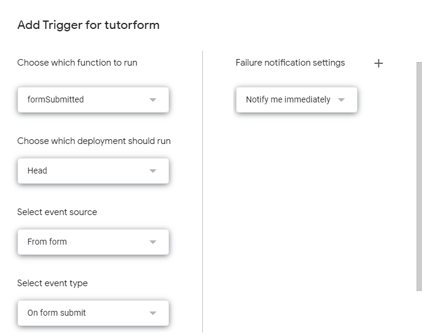
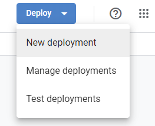
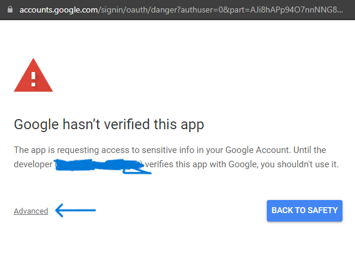
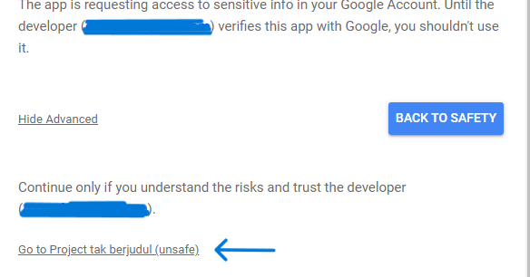

# GForm Real-time Notify to Telegram

## Notify on Google Form Responses in Real-time through Telegram

Receive instant notifications on Telegram whenever someone submits a response to your Google Form. *Follow the guide below to get started:*

1. [Create the Drive folder](#create-the-drive-folder)
2. [Create the Google Form](#create-the-google-form)
3. [Create a Telegram Bot](#create-a-telegram-bot-for-notifications)
4. [Get Your Telegram Chat_ID](#get-your-telegram-chat_id)
5. [Set up the Script](#set-up-the-script)
6. [Set up the Trigger](#set-up-the-trigger)

More:

1. [Unsafe Warning Message](#how-to-deal-with-the-warning-message)
2. [Find A Bug?](#find-a-bug)

### Create the Drive folder

1. On your computer, go to [drive.google.com](https://drive.google.com)
2. On the left, click New  Folder.
3. Enter a name for the folder.
4. Click Create.
5. Double click on the folder 

### Create the Google Form

To create a form directly from Google Drive:
1. Once you [Create the Drive folder](#create-the-drive-folder).
2. Go inside the folder with double-clicking on it.
3. In the top left, click **New**  **Google Forms**.
4. Double click to Enter
5. Edit Your own form
6. Click **Send** to make it accessible


### Create a Telegram Bot for Notifications

1. Go to [BotFather](https://t.me/BotFather) in [Telegram](https://web.telegram.org)
2. Press **start** 
3. type **/newbot** and **Send/Enter**
4. Follow the instruction, till this message appear:

    

5. Copy the **HTTP API** and Save it. *We'll use it later*
6. **Start** your bot like you're start the **BotFather**
    
    

7. Once you started, it'll do nothing.

### Get Your Telegram Chat_ID

1. Go to [UserInfoBot](https://t.me/userinfobot) in [Telegram](https://web.telegram.org)
2. Once you **Start** it, It'll return your profile information.
3. copy your **ID**, and save it for later.

    


### Set up the Script

1. Enter the [New Form u created](#create-the-google-form) earlier
2. In the top right, Click at the  **three dots ⋮**
3. Click at the Script Editor

    

4. You'll be redirected to **Apps Script**

    
  It is based on JavaScript and runs in the cloud rather than on your device

5. Paste the code from [Script.gs](Script.js)

    

6. Don't Forget to Change the [Chat_ID](#get-your-telegram-chat_id) and [Bot Token](#create-a-telegram-bot-for-notifications)

    ```JavaScript
    let token = "Your token goes here"
    const chat_id = ["Your ID goes here"]
    ```
    


### Set Up The Trigger

1. Set the **Trigger**, to make it run everytime someone submit

    

2. On the bottom left, Press **Add Trigger** Button 

3. Set the trigger like this:

    

    and **Save**

    >Once you save it, commonly you'll get a Warning Message... [**See More**](#how-to-deal-with-the-warning-message)
    

4. **Deploy** Your code by cicking deploy button, and **New Deployment**

    


### How To Deal with The Warning Message

1. If your **Warning** might look like these

    

2. Click the underlined text, **Advanced** 
3. It'll expand, click the option **Go to project "project name"(unsafe)**

    


### Find a Bug?

  <p style="text-align: justify; text-indent: 20px;">If you've come across a <b>bug</b> or <b>identified an issue</b> with this project, <u>we welcome you to share your findings!</u> Please use the <b><a href="https://github.com/Dzadaafa/GFormNotifyTelegram/issues">"Issues"</a></b> tab above to report the problem. Your feedback is invaluable in helping us improve and maintain the project. Thank You!</p> 
